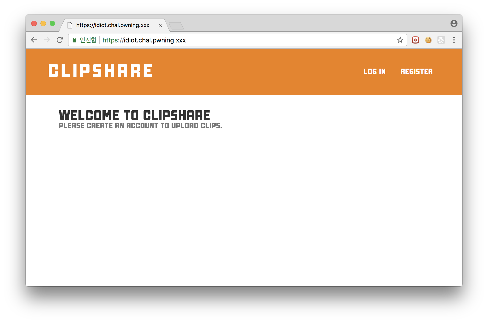
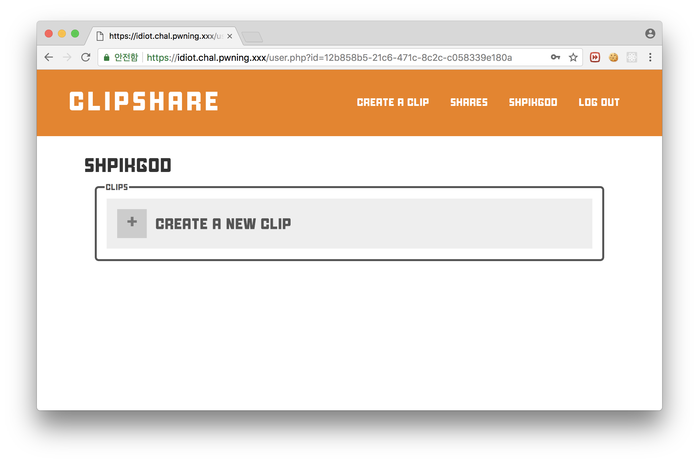

# [Web] Plaid CTF - idIoT: Action

## Description

Some people won't let any smart devices in their home at all. Some are cautious, do their research, and make an informed decision. This guy falls in neither category; he's a a downright idIoT.

The idIoT uses this service called [clipshare](https://idiot.chal.pwning.xxx/); you can find his account [here](https://idiot.chal.pwning.xxx/user.php?id=3427e48e-a6eb-4323-aed4-3ce4a83d4f46) or [here](https://idiot.chal.pwning.xxx/user.php?id=8660d251-d77c-4316-ac2c-a9a0662e6240) after you make an account.

He was telling me the other day about how he has a Google Home next to his computer running at all times. He also told me that if you ask politely it will tell you the flag. However, while he'll look at anything you share, he closes it almost immediately if he doesn't seem like it'll interest him. Maybe we can look at his clips to find something to match his interests?

(Flag format: PCTF{xxx} where xxx is some text composed of lower-case letters and underscores)

## Analysis

문제에 들어가면 다음과 같이 로그인 페이지가 나타나며, Register 후 로그인할 수 있다.



로그인 하면 아래와 같은 페이지가 나타나며 사용할 수 있는 메뉴는 Create a clip, shares, shpikgod, logout이다.



메뉴에 대해 간단히 설명하면 다음과 같다.

- CREATE A CLIP : 새로운 클립을 생성한다.
- SHARES : 공유받은 클립을 보여준다.
- SHPIKGOD : Profile 페이지으로 로그인 시 처음 나타는 화면이며, 자신이 작성한 클립을 보여준다.(위의 이미지 사진)
- LOG OUT : 로그아웃

CREATE A CLIP을 통해 XSS을 유발하는 스크립트를 삽입하여 관리자 계정(idiot1)로 SHARE를 하면 Bot이 이를 읽어 세션을 탈취하는 문제인 것 같다.

우선 헤더를 살펴보면 CSP가 걸려있는 것을 확인할 수 있다.

```
Cache-Control: no-store, no-cache, must-revalidate
Connection: Keep-Alive
Content-Encoding: gzip
Content-Length: 408
Content-Security-Policy: style-src 'self' https://fonts.googleapis.com; font-src 'self' https://fonts.gstatic.com; media-src 'self' blob:; script-src 'self'; object-src 'self'; frame-src 'self'
Content-Type: text/html; charset=UTF-8
Date: Wed, 09 May 2018 15:33:55 GMT
Expires: Thu, 19 Nov 1981 08:52:00 GMT
Keep-Alive: timeout=5, max=100
Pragma: no-cache
Server: Apache/2.4.18 (Ubuntu)
Vary: Accept-Encoding
```

어마무시한 CSP가 걸려있는데 img 태그는 self가 안걸려있으므로, 이를 이용해 bot이 돌고있는지 확인하였다.

```html

```

봇은 돌고있는 것을 확인하였으니, 스크립트를 삽입하여 쿠키를 획득해야한다.

하지만 CSP  `script-src 'self'`에 의해 외부의 스크립트는 로드할 수 없으며, 또한 unsafe-inline에 의해 스크립트 삽입이 불가능하다.


istel 구조는 decrypt할 때 Key의 값을 거꾸로 넣어주기만 하여 encrypt 로직에 넣으면 복호화가 된다.

또한 문제에서 아래와 같이 암호화 로직을 사용하여 얻은 플래그 값이 주어졌다.

```python
from N1ES import N1ES
import base64
key = "wxy191iss00000000000cute"
n1es = N1ES(key)
flag = "N1CTF{*****************************************}"
cipher = n1es.encrypt(flag)
print base64.b64encode(cipher)  # HRlgC2ReHW1/WRk2DikfNBo1dl1XZBJrRR9qECMNOjNHDktBJSxcI1hZIz07YjVx
```

## Exploit

```python
def decrypt(self, plaintext):
        if (len(plaintext) % 16 != 0 or isinstance(plaintext, bytes) == False):
            raise Exception("plaintext must be a multiple of 16 in length")
        res = ''
        for i in range(len(plaintext) / 16):
            block = plaintext[i * 16:(i + 1) * 16]
            L = block[:8]
            R = block[8:]
            for round_cnt in range(31,-1,-1):
                L, R = R, (round_add(L, self.Kn[round_cnt]))
            L, R = R, L
            res += L + R
        return res
```

Key만 거꾸로 변경해주면 decrypt함수를 만들어 줄 수 있다.

이를 주어진 문제의 N1ES 클래스에 넣어주고 아래의 코드를 실행하면 플래그를 얻을 수 있다.

```python
from N1ES import N1ES
cipher = 'HRlgC2ReHW1/WRk2DikfNBo1dl1XZBJrRR9qECMNOjNHDktBJSxcI1hZIz07YjVx'.decode('base64')
key = "wxy191iss00000000000cute"
n1es = N1ES(key)
print n1es.decrypt(cipher)

# N1CTF{F3istel_n3tw0rk_c4n_b3_ea5i1y_s0lv3d_/--/}
```


**N1CTF{F3istel_n3tw0rk_c4n_b3_ea5i1y_s0lv3d_/--/}**